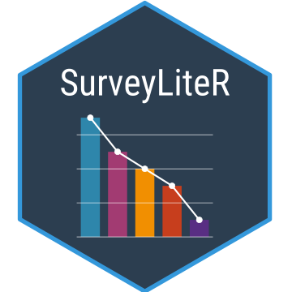
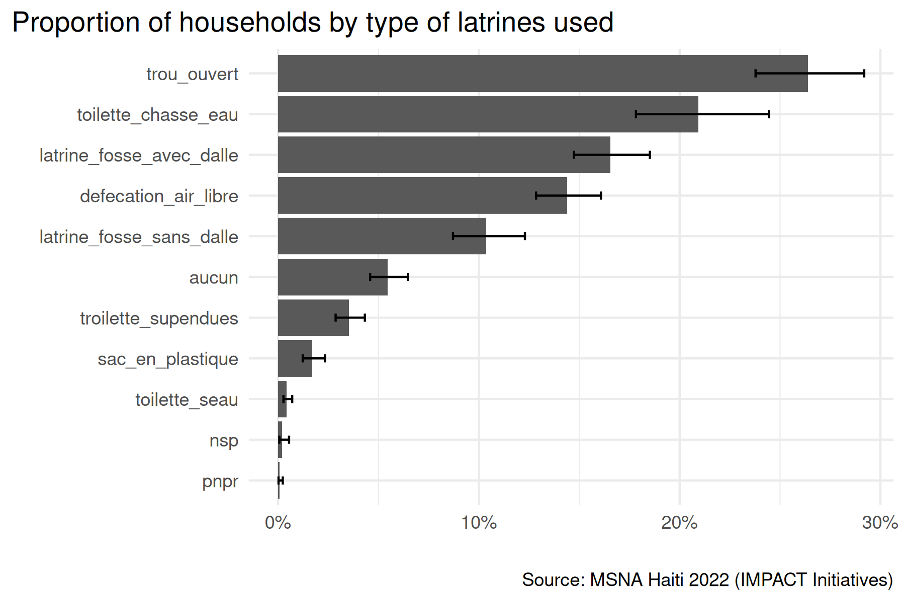
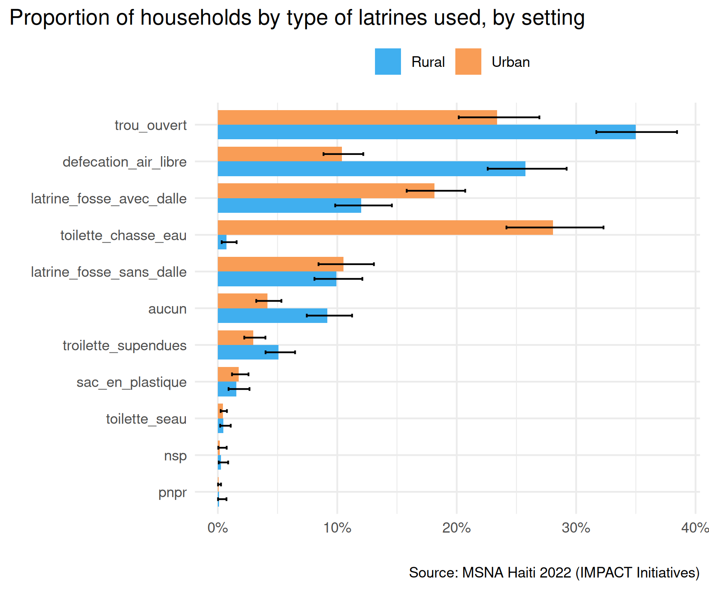

<!-- README.md is generated from README.Rmd. Please edit that file -->

<a href="https://gnoblet.github.io/SurveyLiteR/"></a>

<!-- badges: start -->

[](https://github.com/gnoblet/SurveyLiteR/actions/workflows/R-CMD-check.yaml)
[](https://app.codecov.io/gh/gnoblet/SurveyLiteR)
<!-- badges: end -->

**SurveyLiteR** provides a streamlined workflow for analyzing survey
data based on sampling designs (weights, strata, clusters). Whether
you’re working with data collected with
[KoboToolbox](https://www.kobotoolbox.org/) data or any survey data
really, this package offers standardized analysis functions built on top
of the `srvyr` package. It standardizes outputs which you can use for
faster reporting and visualization.

If you are a (I)NGO or a UN agency analyst, data officer, information
management officer, MEAL officer, and you work with survey data, this
package is for you!

## When to Use SurveyLiteR

<table>
<tr>
<td width="50%" valign="top">

✅ **Perfect for:**

-   Survey data with weights, strata, or clusters
-   KoboToolbox data analysis
-   Standardized reports with confidence intervals
-   Quick automated analysis
-   Consistent output formats

</td>
<td width="50%" valign="top">

❌ **Not needed for (although working):**

-   Simple unweighted data analysis
-   Non-survey statistical analysis

</td>
</tr>
</table>

Although, the package remains useful even if you don’t have weights,
strata, or clusters, as it still provides a consistent and easy-to-use
interface for survey analysis. Just set weights to 1 and strata/clusters
to NULL!

Note that it is shared AS IS WITHOUT ANY WARRANTY, and is not meant to
be a drop-in replacement for more comprehensive survey analysis packages
like `survey` or `srvyr`. It is only designed to simplify common survey
analysis tasks.

## Quick Start

### Installation

``` r
# Install from GitHub
pak::pak("gnoblet/SurveyLiteR")
```

### Let’s run an example!

The package includes real survey data, coming from a humanitarian
Multi-Sector Needs Assessment) run in Haiti by the INGO IMPACT
Initiatives in 2022.

``` r
library(SurveyLiteR)

# Load the example data
data("design") # Survey design with weights, strata, clusters
data("main") # Survey data (household-level data)
data("survey") # KoboToolbox survey sheet
data("choices") # KoboToolbox choices sheet
data("analysis_dap") # Data Analysis Plan (31 indicators)
```

Now, let’s imagine I want to analyze the variable `h_2_type_latrine`,
which is a single-choice categorical variable about the type of latrines
used by the household.

``` r
# This is a generic survey analysis function
so <- svy_proportion(design, "h_2_type_latrine")
```

``` r
# This is a specific KoboToolbox analysis function
so <- kobo_select_one(design, "h_2_type_latrine", survey, choices)
```

The analysis run with the `kobo_select_one()` function returns a data
frame with labels and a row per category, along with the weighted
proportion, confidence intervals, unweighted counts, number of missing
values, etc.. Here is a preview of the output:

``` r
so[, .(var_value, stat, stat_low, stat_upp, n_unw)] |> head(5)
#>                   var_value        stat     stat_low    stat_upp n_unw
#>                      <char>       <num>        <num>       <num> <int>
#> 1:                    aucun 0.054484395 0.0458488645 0.064636228   221
#> 2:     defecation_air_libre 0.143896781 0.1284883750 0.160812018   636
#> 3: latrine_fosse_avec_dalle 0.165391479 0.1473257185 0.185191407   566
#> 4: latrine_fosse_sans_dalle 0.103669595 0.0871157213 0.122945421   410
#> 5:                      nsp 0.001886509 0.0006492863 0.005468372     5
```

We can easily visualize the results with `ggplot2`:

``` r
library(ggplot2)
library(scales)
library(forcats)
library(data.table)

# reorder and factor by highest value last (for ggplot2 horizontal bar chart)
so[, var_value := forcats::fct_reorder(var_value, stat, .desc = FALSE)]

# plot
ggplot(so, aes(x = var_value, y = stat)) +
  geom_col() +
  scale_y_continuous(labels = label_percent()) +
  geom_errorbar(
    aes(ymin = stat_low, ymax = stat_upp),
    width = 0.2,
    linewidth = 0.5
  ) +
  labs(
    title = "Proportion of households by type of latrines used",
    x = "",
    y = "",
    caption = "Source: MSNA Haiti 2022 (IMPACT Initiatives)"
  ) +
  coord_flip() +
  theme_minimal() +
  theme(
    plot.title.position = "plot"
  )
```



If you want to get labels directly from kobo, you can use:
`x = var_value_label` instead of `x = var_value`.

Now, let’s disaggregate the results by urban/rural setting, using the
`group` argument:

``` r
# Disaggregation by urban/rural setting
so2 <- kobo_select_one(
  design,
  "h_2_type_latrine",
  survey,
  choices,
  group = "milieu"
)

# reorder and factor by highest value last (for ggplot2 horizontal bar chart)
so2[, var_value := forcats::fct_reorder(var_value, stat, .desc = FALSE)]
# recode group values
so2[,
  group_key_value := forcats::fct_recode(
    group_key_value,
    "Urban" = "urbain",
    "Rural" = "rural"
  )
]
# plot (using ggplot4.0.0+ palette.fill.discrete)
ggplot(so2, aes(x = var_value, y = stat, fill = group_key_value)) +
  geom_col(width = 0.8, position = position_dodge(width = 0.8)) +
  scale_y_continuous(labels = label_percent()) +
  geom_errorbar(
    aes(ymin = stat_low, ymax = stat_upp),
    width = 0.2,
    linewidth = 0.5,
    position = position_dodge(width = 0.8)
  ) +
  labs(
    title = "Proportion of households by type of latrines used, by setting",
    x = "",
    y = "",
    fill = "",
    caption = "Source: MSNA Haiti 2022 (IMPACT Initiatives)"
  ) +
  coord_flip() +
  theme_minimal() +
  theme(
    plot.title.position = "plot",
    legend.position = "top",
    palette.fill.discrete = c("#40afefff", "#f99d56ff")
  )
```



## Analysis Workflow Decision Tree

### What’s your data source?

<table>
<tr>
<td width="50%" valign="top">

📋 **KoboToolbox Data**

-   Have survey and choices sheets
-   Want labeled outputs
-   Need simple or multiple choice analysis

**→ Go to [KoboToolbox Workflow](#kobo-path)**

</td>
<td width="50%" valign="top">

📊 **Other Survey Data**

-   Have survey weights/strata/clusters
-   Want quick simple reuslts
-   No need for Kobo-specific features

**→ Go to [General Survey Workflow](#general-path)**

</td>
</tr>
</table>

------------------------------------------------------------------------

### <a id="kobo-path"></a>🎛️ KoboToolbox Workflow

#### Organised analysis plan or automation

**Best for:** Full analysis with minimal coding with a prepared Data
Analysis Plan (DAP) or running quick exploratory analysis from the Kobo
Tool.

``` r
#kobo_analysis_from_dap(design, analysis_dap, survey, choices)
auto_kobo_analysis(design, survey, choices, level = 0.95, choices_sep = "/")
```

#### Individual Analysis by Variable Type

<table>
<colgroup>
<col style="width: 44%" />
<col style="width: 29%" />
<col style="width: 26%" />
</colgroup>
<thead>
<tr>
<th>Variable Type</th>
<th>Function</th>
<th>Example</th>
</tr>
</thead>
<tbody>
<tr>
<td>📊 <strong>Categorical (single)</strong></td>
<td><code>kobo_select_one()</code></td>
<td><code>kobo_select_one(design, "h_2_type_latrine", survey, choices)</code></td>
</tr>
<tr>
<td>📊 <strong>Categorical (multiple)</strong></td>
<td><code>kobo_select_multiple()</code></td>
<td><code>kobo_select_multiple(design, "h_1_acces_eau", survey, choices)</code></td>
</tr>
<tr>
<td>📈 <strong>Numeric (symmetric)</strong></td>
<td><code>kobo_mean()</code></td>
<td><code>kobo_mean(design, "c_total_age_3a_17a", survey, choices)</code></td>
</tr>
<tr>
<td>📈 <strong>Numeric (skewed)</strong></td>
<td><code>kobo_median()</code></td>
<td><code>kobo_median(design, "f_5_depenses_ba", survey, choices)</code></td>
</tr>
<tr>
<td>➗ <strong>Ratios</strong></td>
<td><code>kobo_ratio()</code></td>
<td><code>kobo_ratio(design, "e_freq_regt", "c_total_age_3a_17a", survey, choices)</code></td>
</tr>
<tr>
<td>🔗 <strong>Cross-tabs</strong></td>
<td><code>kobo_interact()</code></td>
<td><code>kobo_interact(design, c("h_2_type_latrine", "fcs_cat"), survey, choices)</code></td>
</tr>
<tr>
<td>🔄 <strong>Flexible</strong></td>
<td><code>kobo_analysis()</code></td>
<td><code>kobo_analysis(design, "mean", "c_total_age_3a_17a", survey, choices)</code></td>
</tr>
</tbody>
</table>

**Batch Analysis Functions:** The below functions analyze all variables
of a given type in one go, based on the survey and choices sheets.

``` r
# Analyze all variables of each type at once
kobo_select_one_all(design, survey, choices)
kobo_select_multiple_all(design, survey, choices)
kobo_mean_all(design, survey, choices)
kobo_median_all(design, survey, choices)
```

------------------------------------------------------------------------

### <a id="general-path"></a>⚡ General Survey Workflow

#### Quick Automation

**Best for:** Rapid exploratory analysis

``` r
auto_svy_analysis(design)
```

#### Manual Control by Variable Type

<table>
<colgroup>
<col style="width: 44%" />
<col style="width: 29%" />
<col style="width: 26%" />
</colgroup>
<thead>
<tr>
<th>Variable Type</th>
<th>Function</th>
<th>Example</th>
</tr>
</thead>
<tbody>
<tr>
<td>📊 <strong>Categorical</strong></td>
<td><code>svy_proportion()</code></td>
<td><code>svy_proportion(design, "h_2_type_latrine")</code></td>
</tr>
<tr>
<td>📈 <strong>Numeric (symmetric)</strong></td>
<td><code>svy_mean()</code></td>
<td><code>svy_mean(design, "c_total_age_3a_17a")</code></td>
</tr>
<tr>
<td>📈 <strong>Numeric (skewed)</strong></td>
<td><code>svy_median()</code></td>
<td><code>svy_median(design, "f_5_depenses_ba")</code></td>
</tr>
<tr>
<td>📏 <strong>Distributions</strong></td>
<td><code>svy_quantile()</code></td>
<td><code>svy_quantile(design, "f_5_depenses_ba")</code></td>
</tr>
<tr>
<td>➗ <strong>Ratios</strong></td>
<td><code>svy_ratio()</code></td>
<td><code>svy_ratio(design, "e_freq_regt", "c_total_age_3a_17a")</code></td>
</tr>
<tr>
<td>🔗 <strong>Cross-tabs</strong></td>
<td><code>svy_interact()</code></td>
<td><code>svy_interact(design, c("h_2_type_latrine", "fcs_cat"))</code></td>
</tr>
<tr>
<td>🔄 <strong>Flexible</strong></td>
<td><code>svy_analysis()</code></td>
<td><code>svy_analysis(design, "mean", "c_total_age_3a_17a")</code></td>
</tr>
</tbody>
</table>

## 📋 Data Analysis Plan Format

Create your own DAP based on the included example:

``` r
# View the example DAP structure
head(analysis_dap)

# Your DAP should have at least the 'analysis', 'var', and 'na_rm' columns:
my_dap <- data.frame(
  analysis = c("mean", "select_one", "select_multiple", "ratio"),
  var = c(
    "c_total_age_3a_17a", # mean: number of children aged 3-17
    "h_2_type_latrine", # select_one: type of latrines
    "h_1_acces_eau", # select_multiple: water access issues
    "e_freq_regt,c_total_age_3a_17a" # ratio: school attendance rate
  ),
  na_rm = c("yes", "no", "yes", "no"),
  sector = c("Demographics", "WASH", "WASH", "Education"),
  indicator = c(
    "Mean number of children aged 3-17 in household",
    "% of households by type of latrine",
    "% of households by water access issues",
    "School attendance rate among children aged 3-17"
  )
)
```

**Supported analysis types:**

-   `"mean"` - for numeric variables (e.g., `c_total_age_3a_17a`)
-   `"median"` - for skewed numeric variables (e.g., `f_5_depenses_ba`)
-   `"select_one"` - for single-choice categorical (e.g.,
    `h_2_type_latrine`)
-   `"select_multiple"` - for multiple-choice questions (e.g.,
    `h_1_acces_eau`)
-   `"ratio"` - for rates (format: “numerator,denominator”)
-   `"interact"` - for cross-tabulations (format: “var1,var2”)

## 🔍 Understanding Outputs

All `svy_*()` functions return standardized data frames with:

-   **`group_key`**: Grouping variable (if any)
-   **`group_key_value`**: Specific group level (if grouped)
-   **`var`**: Variable name
-   **`var_value`**: Category/level (for categorical variables)
-   **`stat`**: Main statistic (mean, proportion, etc.)
-   **`stat_low`**, **`stat_upp`**: Confidence interval bounds
-   **`stat_unw`**: Unweighted statistic
-   **`n_unw`**: Unweighted sample size
-   **`stat_type`**: Type of analysis performed
-   **`n_tot_unw`**: Total sample size for the group (if any, else
    overall)
-   **`n_tot`**: Total weighted sample
-   **`na_count_tot`**: Total missing values for the variable
-   **`analysis_key`**: Unique identifier for each analysis

For interactions, additional columns like `interact_key` and
`interact_key_value` are included.

The **`analysis_key`** is built as follows:
`\<stat_type\> @/@ \<var\> %/% \<var_value\> @/@ \<group\> %/% \<group_value\>`.
For instance, the key for a proportion of Household Hunger Scale (HHS)
categories by setting could be:
`proportion @/@ hhs_cat %/% Little @/@ setting %/% rural`.

When using `kobo_*()` functions, additional metadata columns from the
survey and choices sheets are included, such as labels of variables and
choices and the type of question.

------------------------------------------------------------------------

# Questions or Issues?

-   🐛 Report bugs on
    [GitHub](https://github.com/gnoblet/SurveyLiteR/issues)—please with
    MWE.
-   💬 Feature requests goes there too.
-   Feel free to reach out on Bluesky or Linkedin (@gnoblet) for
    questions or help.
